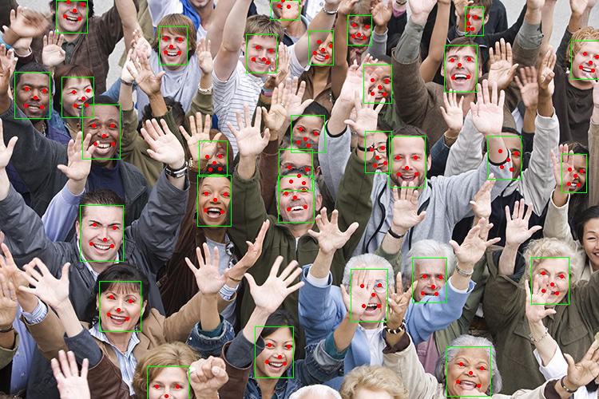

# Face ID

Face detection & recognition crate.

## Face detection models

This crate uses SCRDF face detection models. The following models are available:

> The naming convention for the ONNX models indicates the computational complexity (measured in FLOPs) and whether the
> model includes 5 facial keypoints predictions in addition to standard bounding boxes.

|      Name       | Easy  | Medium | Hard  | FLOPs | Params(M) | Infer(ms) | BBox | Facial Keypoints |
|:---------------:|-------|--------|-------|-------|-----------|-----------|:-----|:-----------------|
|    500m.onnx    | 90.57 | 88.12  | 68.51 | 500M  | 0.57      | 3.6       | ✅    | ❌                |
|     1g.onnx     | 92.38 | 90.57  | 74.80 | 1G    | 0.64      | 4.1       | ✅    | ❌                |
|    34g.onnx     | 96.06 | 94.92  | 85.29 | 34G   | 9.80      | 11.7      | ✅    | ❌                |
| 2.5g_bnkps.onnx | 93.80 | 92.02  | 77.13 | 2.5G  | 0.82      | 4.3       | ✅    | ✅                |
| 10g_bnkps.onnx  | 95.40 | 94.01  | 82.80 | 10G   | 4.23      | 5.0       | ✅    | ✅                |
| 34g_gnkps.onnx  | ?     | ?      | ?     | 34G   | ?         | ?         | ✅    | ✅                |

### Keypoints (`kps`) and Normalization Types (`bn` vs `gn`)

- **`kps`**: Denotes models that output 5 facial landmarks (keypoints) in addition to the standard bounding boxes.
- **`bnkps`**: Models trained using **Batch Normalization (BN)**. These often have lower false-positive rates and high
  recall on general datasets. However, they occasionally struggle with producing accurate landmarks for faces that are
  rotated past 90 degrees or are unusually large.
- **`gnkps`**: Models trained using **Group Normalization (GN)**. These variants (e.g., `34g_gnkps` or `10g_gnkps`) were
  explicitly developed to fix issues with very large faces that the `bnkps` models exhibited. While they improve
  landmark quality on large or rotated faces, they might have slightly lower general recall than `bnkps`.
