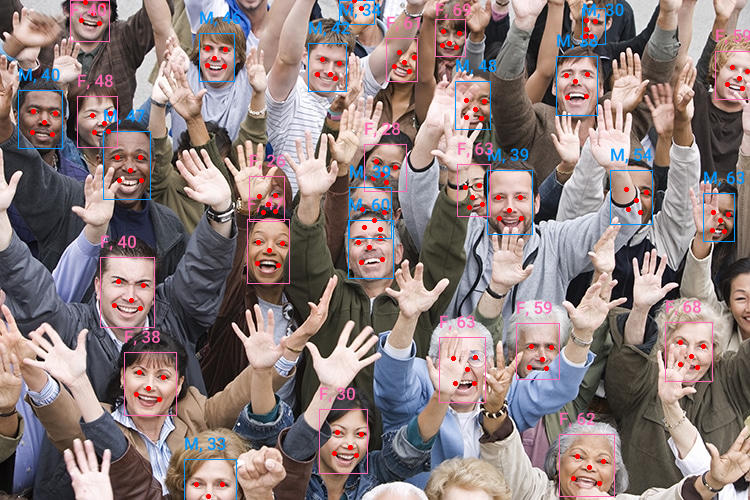

# Face ID

Easily run face detection, landmark prediction, facial recognition, and attribute estimation in Rust via ONNX Runtime.

[](https://crates.io/crates/face_id)
[](https://docs.rs/face_id)



## Features

- **Detection**: Face detection using [SCRFD](https://github.com/deepinsight/insightface/tree/master/detection/scrfd).
- **Landmarks**: Predict 5 facial keypoints (eyes, nose, mouth) for alignment.
- **Recognition**: Generate 512-d embeddings
  using [ArcFace](https://github.com/deepinsight/insightface/tree/master/recognition/arcface_torch) for identity
  verification.
- **Attributes**: Estimate gender and age.
- **Automatic Alignment**: Built-in transforms to align faces to the pose required by recognition models.
- **HF Integration**: Automatically download pre-trained models from HuggingFace.

## Usage

The `FaceAnalyzer` is the easiest way to use this crate. It handles the entire pipeline: detecting faces, aligning them,
and running recognition/attribute models in batches.

```rust
use face_id::analyzer::FaceAnalyzer;

#[tokio::main]
async fn main() -> anyhow::Result<()> {
    // Initialize the analyzer (downloads models from HuggingFace on first run)
    let analyzer = FaceAnalyzer::from_hf().build().await?;

    let img = image::open("assets/img/crowd.jpg")?;
    let faces = analyzer.analyze(&img)?;

    for (i, face) in faces.iter().enumerate() {
        println!("Face #{}", i);
        println!("  Score: {:.2}", face.detection.score);
        println!("  BBox: {:?}", face.detection.bbox);

        if let Some(ga) = &face.gender_age {
            println!("  Gender: {:?}, Age: {}", ga.gender, ga.age);
        }

        if let Some(emb) = &face.embedding {
            println!("  Embedding (first 5 dims): {:?}", &emb[..5]);
        }
    }

    Ok(())
}
```

## Usage: Individual Components

You can also use the components individually if you don't need the full pipeline.

### Face Detection only

The `ScrfdDetector` finds face bounding boxes when given an image. When using a `_kps` model, it also returns the
location of the eyes, nose and mouth.

```rust
use face_id::detector::ScrfdDetector;

#[tokio::main]
async fn main() -> anyhow::Result<()> {
    let mut detector = ScrfdDetector::from_hf().build().await?;
    let face_boxes = detector.detect(&img)?;
}
```

### Facial Recognition (Embeddings)

Recognition requires **aligned** face crops, meaning the eyes, nose and mouth are warped to the spot the embedding model
expects them. This crate provides `face_align::norm_crop` to transform a face based on its landmarks into the 112x112
format required by ArcFace.

```rust
use face_id::embedder::ArcFaceEmbedder;
use face_id::face_align::norm_crop;

#[tokio::main]
async fn main() -> anyhow::Result<()> {
    let mut embedder = ArcFaceEmbedder::from_hf().build().await?;

    // Align the face using detected landmarks
    let aligned_img = norm_crop(&img, &landmarks, 112);

    // Compute embedding
    let embedding = embedder.compute_embedding(&aligned_img)?;

    // Now you can compare if two faces are the same person, 
    // or cluster a bunch of face embeddings to group them.
}
```

## Execution Providers (Nvidia, AMD, Intel, Mac, Arm, etc.)

Since this is implemented with `ort`, many execution providers are available to enable hardware acceleration. You can
enable an execution provider in this crate with cargo features. A full list of execution providers is
available [here](https://ort.pyke.io/perf/execution-providers).

To use CUDA, add the `cuda` feature to your `Cargo.toml` and configure the builder:

```rust
use face_id::analyzer::FaceAnalyzer;
use ort::ep::{CUDA, TensorRT};

#[tokio::main]
async fn main() -> anyhow::Result<()> {
    let analyzer = FaceAnalyzer::from_hf()
        .with_execution_providers(&[
            TensorRT::default().build(),
            CUDA::default().build(),
        ])
        .build()
        .await?;
}
```

## Model Details

### Detection (SCRFD)

The naming convention for SCRFD models indicates complexity (FLOPs) and whether they include 5-point facial keypoints (
`kps`).

|      Name       | Easy  | Medium | Hard  | FLOPs | Params(M) | Infer(ms) | BBox | Facial Keypoints |
|:---------------:|-------|--------|-------|-------|-----------|-----------|:-----|:-----------------|
|    500m.onnx    | 90.57 | 88.12  | 68.51 | 500M  | 0.57      | 3.6       | ✅    | ❌                |
|     1g.onnx     | 92.38 | 90.57  | 74.80 | 1G    | 0.64      | 4.1       | ✅    | ❌                |
|    34g.onnx     | 96.06 | 94.92  | 85.29 | 34G   | 9.80      | 11.7      | ✅    | ❌                |
| 2.5g_bnkps.onnx | 93.80 | 92.02  | 77.13 | 2.5G  | 0.82      | 4.3       | ✅    | ✅                |
| 10g_bnkps.onnx  | 95.40 | 94.01  | 82.80 | 10G   | 4.23      | 5.0       | ✅    | ✅                |
| 34g_gnkps.onnx  | 96.17 | 95.19  | 84.88 | 34G   | 9.84      | 11.8      | ✅    | ✅                |

- **BN vs GN**: `bnkps` (Batch Norm) models have higher general recall. `gnkps` (Group Norm) models are specifically
  better at handling very large faces or faces rotated past 90 degrees.
- Easy/Medium/Hard refers to accuracy on training data,
  source: [insightface](https://github.com/deepinsight/insightface/blob/master/detection/scrfd/README.md#pretrained-models).
- `34g_gnkps` is an evolution of the `bnkps` models, more info, and source for the `gnkps` numbers
  here: https://modelscope.cn/models/iic/cv_resnet_facedetection_scrfd10gkps/summary

### Recognition (ArcFace)

The default recognition model is `w600k_r50.onnx` (ResNet-50) from the InsightFace "Buffalo_L" bundle. It produces a *
*512-dimensional** L2-normalized vector.

## Features

- `hf-hub` (Default): Allows downloading models from Hugging Face.
- `copy-dylibs` / `download-binaries` (Default): Simplifies `ort` setup.
- `serde`: Enables serialization/deserialization for results.
- **Execution Providers**: `cuda`, `tensorrt`, `coreml`, `directml`, `openvino`, etc.

## Troubleshooting

### Dynamic Linking

If you are using the `load-dynamic` feature and encounter library errors:

1. Download the `onnxruntime` library from [GitHub Releases](https://github.com/microsoft/onnxruntime/releases).
2. Set the `ORT_DYLIB_PATH` environment variable:
   ```shell
   # Linux/macOS
   export ORT_DYLIB_PATH="/path/to/libonnxruntime.so"
   # Windows (PowerShell)
   $env:ORT_DYLIB_PATH = "C:/path/to/onnxruntime.dll"
   ```
